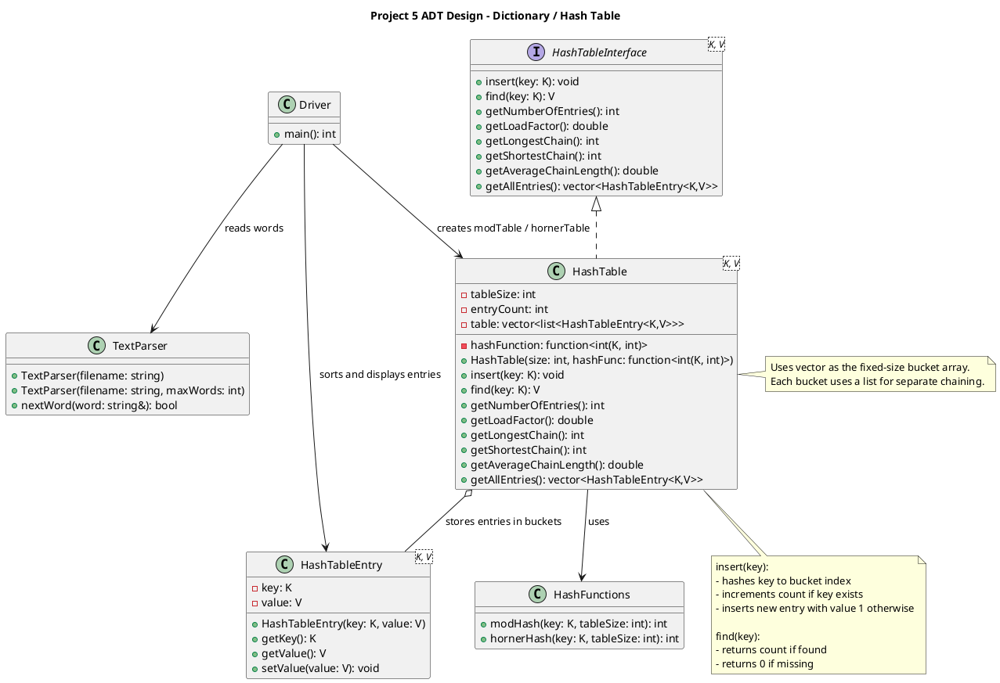

# ADT Design: Dictionary and Hash Table

## Purpose

The purpose of the Dictionary ADT is to store and retrieve key-value pairs efficiently. In this project, the dictionary is used to count word frequencies from a text file, where each unique word is a key and its frequency is the associated value.

A hash table is chosen as the implementation because it provides **O(1) average-case performance** for insertion and lookup. This makes it well-suited for processing large datasets, such as the SICP text, where many repeated lookups and updates are required.

---

## Logical Data Model

At the ADT level, the dictionary is viewed as a collection of unique keys, each associated with a value.

- Keys: words (strings)
- Values: integer counts representing the number of occurrences

The structure is conceptualized as:

`key -> value`

For example: 

`
"the" → 12966
"procedure" → 1294
"abstraction" → 42
`
The ADT does not expose how data is stored internally. It does not involve buckets, arrays, or linked lists at this level. It simply provides a mapping from keys to values.

---


## Operations

### `insert(key)`

- If the key does not exist, it is added to the dictionary with an initial value of 1.
- If the key already exists, its value is incremented by 1.
- This operation is used to build the word frequency table.

---

### `find(key)`

- Returns the value associated with the given key.
- If the key is not present, returns 0.
- This allows queries for word frequency.

---

### `getNumberOfEntries()`

- Returns the number of unique keys stored in the dictionary.
- Represents the number of distinct words in the text.

---

### `getLoadFactor()`

- Returns the ratio of total entries to table size.
- Used to evaluate how full the hash table is.

---

### `getLongestChain()`

- Returns the maximum number of entries stored in any single bucket.
- Represents the worst-case lookup scenario.

---

### `getShortestChain()`

- Returns the size of the smallest non-empty bucket.
- Used to analyze distribution of entries.

---

### `getAverageChainLength()`

- Computes the average size of all non-empty buckets.
- Provides insight into the typical lookup cost.

---

### `getAllEntries()`

- Returns a collection of all key-value pairs in the dictionary.
- Used for sorting and generating frequency reports.

---


## Hash Functions at the ADT Level

At the ADT level, a hash function is responsible for mapping a key to an index in the table.

Conceptually, the hash function performs the transformation:

`key -> index`


This allows the dictionary to locate where a key should be stored without searching through all entries.

The dictionary relies on the hash function to:

- Distribute keys evenly across the table
- Minimize collisions (multiple keys mapping to the same index)
- Maintain efficient O(1) average-case operations

Different hash functions can be used with the same dictionary ADT, allowing the behavior and performance of the structure to be evaluated independently of its interface.

In this project, two hash functions are used:

- A simple ASCII-sum-based function (`modHash`)
- A position-sensitive polynomial function (`hornerHash`)

The choice of hash function directly affects how evenly keys are distributed and therefore impacts performance.

### Hash Function Overview

Two hash functions were implemented and compared in this project:

---

#### modHash (ASCII Sum)

The `modHash` function computes a hash value by summing the ASCII values of all characters in the key and then taking the result modulo the table size.

Conceptually:

sum of character codes → mod tableSize → bucket index

Example:

"abc" → 97 + 98 + 99 = 294 → 294 % tableSize

**Key property:**
- The order of characters does **not matter**

For example:

- "stop" and "pots" produce the same hash value  
- "abc" and "cba" produce the same hash value  

This happens because addition is **commutative**.

**Implication:**
- Many different words can collapse into the same bucket
- Leads to **collisions and clustering**
- Results in longer chains and slower lookups

---

#### hornerHash (Polynomial Hashing)

The `hornerHash` function treats the string as a polynomial and evaluates it using Horner’s method.

Conceptually:

hash = (hash * base + character) mod tableSize

Using base 31:

Example for "abc":

hash = 0  
→ (0 * 31 + 'a')  
→ (previous * 31 + 'b')  
→ (previous * 31 + 'c')  

Each step multiplies the previous result and adds the next character.

**Key property:**
- Character position **matters**

For example:

- "abc" ≠ "cba"  
- "stop" ≠ "pots"  

Each character contributes differently depending on its position.

**Implication:**
- Produces a more even distribution of keys
- Reduces collisions
- Keeps chain lengths short
- Maintains near O(1) lookup performance

---

### Summary

- `modHash` is simple but ignores character position, leading to clustering.
- `hornerHash` incorporates position, producing a more uniform distribution.

This difference is directly reflected in the observed chain lengths and overall performance of the hash table.

## UML


## Directory Structure

```
project_05/
├── include/
│   ├── HashTableInterface.h       (provided, do not modify)
│   ├── HashTableEntry.h           (provided, do not modify)
│   ├── TextParser.h               (provided, do not modify)
│   ├── HashTable.h                (you implement)
│   └── hashFunctions.h            (you implement)
├── src/
│   ├── TextParser.cpp             (provided, do not modify)
│   └── driver.cpp                 (you implement)
├── texts/
│   └── sicp.txt                   (provided)
├── build/
├── Makefile
├── project_05.md                  (provided, this document)
├── project_05_rubric.md           (provided, do not modify)
├── coding_standards.md            (provided, do not modify)
├── ADT_Design.md
├── Design_Decisions.md
└── README.md
```

## Random Notes: 

```
This project allows STL sequence containers, so the hash table uses std::vector
to store the fixed-size bucket array and std::list for each bucket’s collision
chain. Associative STL containers such as std::unordered_map are not used
because they would replace the hash table implementation rather than support it.
```
```
The hash function is not part of the hash table itself, but is injected into
the table, allowing different hashing strategies to be compared without 
modifying the data structure.
```
