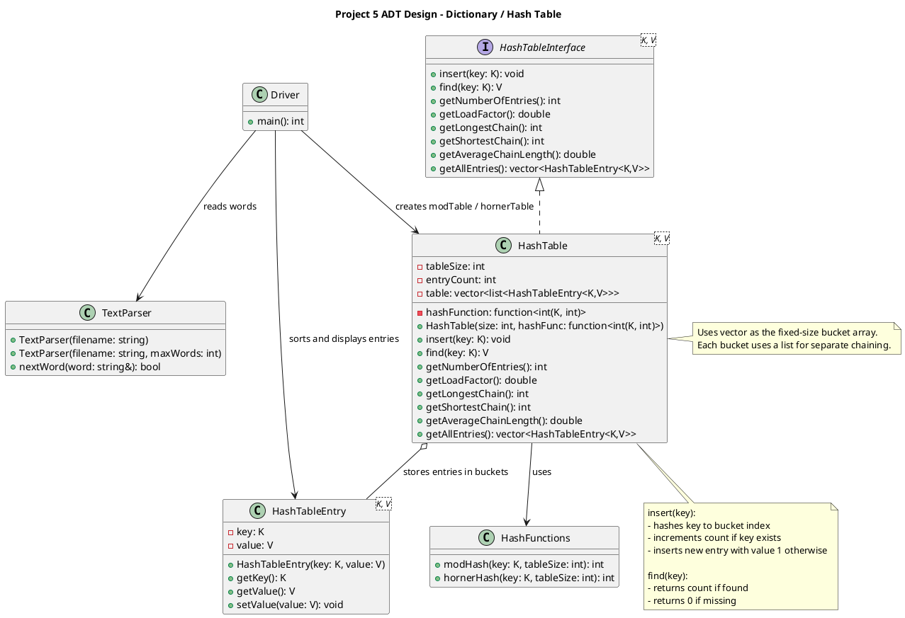

# ADT Design: Dictionary and Hash Table

## Purpose

## Logical Data Model

## Operations

## Hash Functions at the ADT Level

## UML


## Directory Structure

```
project_05/
├── include/
│   ├── HashTableInterface.h       (provided, do not modify)
│   ├── HashTableEntry.h           (provided, do not modify)
│   ├── TextParser.h               (provided, do not modify)
│   ├── HashTable.h                (you implement)
│   └── hashFunctions.h            (you implement)
├── src/
│   ├── TextParser.cpp             (provided, do not modify)
│   └── driver.cpp                 (you implement)
├── texts/
│   └── sicp.txt                   (provided)
├── build/
├── Makefile
├── project_05.md                  (provided, this document)
├── project_05_rubric.md           (provided, do not modify)
├── coding_standards.md            (provided, do not modify)
├── ADT_Design.md
├── Design_Decisions.md
└── README.md
```

## Random Notes: 

```
This project allows STL sequence containers, so the hash table uses std::vector
to store the fixed-size bucket array and std::list for each bucket’s collision
chain. Associative STL containers such as std::unordered_map are not used
because they would replace the hash table implementation rather than support it.
```
```
The hash function is not part of the hash table itself, but is injected into
the table, allowing different hashing strategies to be compared without 
modifying the data structure.
```
